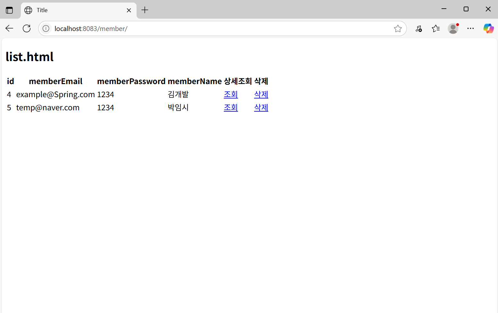

#   Spring Boot 회원 로그인 프로젝트

##  프로젝트 소개
본 프로젝트 **(B 프로젝트)** 는 Spring Boot 기반의 **회원 로그인 백엔드 서비스**입니다.  
기초적인 MVC 구조를 바탕으로 Thymeleaf,JPA,MySQL 등을 사용해 구현되었으며,  
이후 **Vue (C 프로젝트)**, **React (D 프로젝트)** 로 구성된 프론트엔드와 통합하여  
**프론트-백엔드 분리형 구조의 복합 프로젝트**로 확장할 계획입니다.

---

##  버전  
1.1V
---

##  프로젝트 구조
```
member/
├── src/
│ └── main/
│ ├── java/
│ │ └── com.tel.member/
│ │ ├── controller/ # 요청 처리 (HomeController, MemberController)
│ │ ├── dto/ # 데이터 전송 객체 (MemberDTO)
│ │ ├── entity/ # JPA 엔티티 (MemberEntity)
│ │ ├── repository/ # JPA 리포지토리 인터페이스 (MemberRepository)
│ │ └── service/ # 비즈니스 로직 (MemberService)
│ ├── resources/
│ │ ├── static/ 
│ │ ├── templates/ # 뷰 템플릿 (Thymeleaf)
│ │ │ ├── detail.html
│ │ │ ├── index.html
│ │ │ ├── list.html
│ │ │ ├── login.html
│ │ │ ├── main.html
│ │ │ ├── save.html
│ │ │ └── update.html
│ │ └── application.yml # 환경 설정 파일
│ └── MemberApplication.java # 메인 클래스
├── build.gradle
├── settings.gradle
└── README.md
```
---

##  기술 스택

- Java 17
- Spring Boot 3.4.7 
- Thymeleaf
- MySQL
- Gradle              
- Log4j2 및 log4jdbc (로깅 및 DB 쿼리 로그)

---

##  주요 기능

- 회원 가입 
- 로그인 / 로그아웃
- 상세 정보 조회
- 세션 기반 로그인 유지
- Entity-DTO 변환 구조
- Thymeleaf 기반 기본 UI 제공

---

##  프로젝트 통합 계획

본 프로젝트는 추후 다음과 같은 프론트엔드 프로젝트들과 통합 예정입니다:

| 프로젝트 | 설명                        | 프레임워크 |
|----------|-----------------------------|------------|
| C        | 웹 프론트엔드 (SPA)         | Vue 3      |
| D        | 모바일 / 데스크탑 대응 UI   | React      |

각 프론트엔드에서 **회원가입, 로그인 등의 요청을 REST API로 전송**하고,  
B 프로젝트는 이를 처리하여 JSON 응답을 반환하는 구조로 전환할 예정입니다.  
(JWT 기반 인증 방식도 추가 계획 중)

---

## 접속
http://localhost:8083/

---


## 개발자 정보  
이름: 최정규  
이메일: javakyu4030@naver.com


---

## 실행 화면 예시

1. 홈화면

2. 회원가입

3. 로그인

4. 회원리스트

5. 회원상세조회

6. 로그아웃

---

---

## 수정 및 추가 사항

### 버전
V1.1

### 1. 이메일 중복 확인 기능 추가 
회원가입 시 입력한 이메일이 이미 등록되어 있는지 실시간으로 확인하는 기능을 추가하였습니다.
jQuery + Ajax를 활용하여 서버에 비동기 요청을 보내고,
사용자에게 즉각적인 피드백(사용 가능 여부)을 제공합니다.

- 적용 화면: 회원가입 페이지 (save.html)
- 요청 방식: POST /member/email-check
- 응답 형식: JSON
- 프론트 기술: jQuery Ajax
- 백엔드 처리: @PostMapping("/member/email-check") → MemberService에서 이메일 존재 여부 확인

### 실행 화면 예시
1. 이메일 사용 가능시

2. 이메일 중복시

---